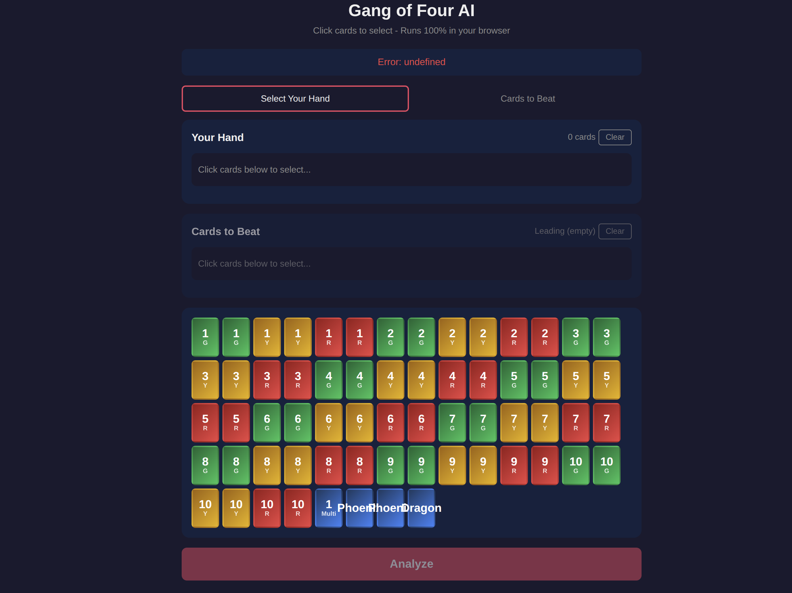

# Gang of Four AI - Web App

A browser-based AI advisor for the Gang of Four card game. Uses a neural network trained via imitation learning to suggest optimal plays.



## Features

- **100% client-side** - Runs entirely in your browser using WebAssembly
- **Visual card picker** - Click cards to select your hand and trick to beat
- **Complete rules** - Supports all combinations: singles, pairs, straights, flushes, full houses, gangs
- **AI recommendations** - Shows best play with confidence percentages
- **Offline capable** - Works without internet after first load

## Model

This app uses the neural network model from:

**[quintana42/gang-of-four-neural](https://huggingface.co/quintana42/gang-of-four-neural)**

- ~920K parameters
- Trained on ~500K expert game states
- Multi-head attention over card regions
- Dual output: action policy + declaration probability

## How It Works

1. **You select** your hand cards and the trick to beat
2. **Rules engine** generates all valid plays (straights, flushes, gangs, etc.)
3. **Neural network** ranks the plays by expected value
4. **App shows** the best recommendation with probabilities

The model doesn't generate plays - it ranks them. The complete game rules are implemented in JavaScript to generate valid options.

## Card Combinations

| Type | Description |
|------|-------------|
| Single | Any single card |
| Pair | Two cards of same rank |
| Three of a Kind | Three cards of same rank |
| Straight | 5 consecutive ranks |
| Flush | 5 cards of same color |
| Full House | 3 of a kind + pair |
| Straight Flush | 5 consecutive same color |
| Gang of Four | 4 of same rank (beats everything) |
| Gang of Five/Six/Seven | Even stronger bombs |

## Run Locally

```bash
cd web
python3 -m http.server 8080
# Open http://localhost:8080
```

## Deploy

Upload the `web/` folder to any static hosting:
- GitHub Pages
- Netlify
- Vercel
- Any web server

## Files

```
web/
├── index.html              # Main app
├── encoder.js              # State encoding (328 features)
├── rules.js                # Complete game rules
└── model/
    └── neural_v3_embedded.onnx  # AI model (3.8 MB)
```

## Tech Stack

- **ONNX Runtime Web** - Neural network inference in WASM
- **Vanilla JS** - No frameworks
- **HuggingFace** - Model hosting

## Credits

- Model: [quintana42/gang-of-four-neural](https://huggingface.co/quintana42/gang-of-four-neural)
- ONNX Runtime: [Microsoft](https://onnxruntime.ai/)

## License

MIT
